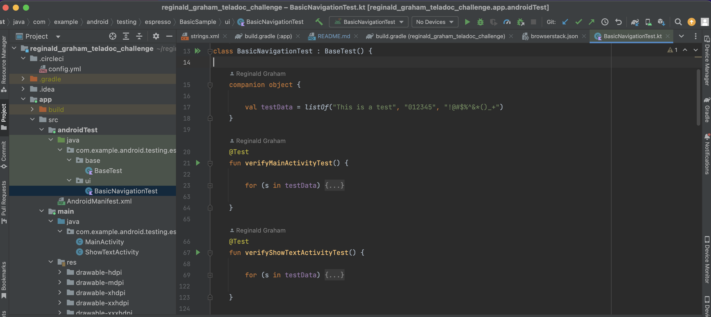

# reginald_graham_teladoc_challenge

## Original Sample Project: 
https://github.com/android/testing-samples/tree/main/ui/espresso/BasicSample

## Test Cases:
You will find two classes in the androidTest package. One class titled BaseTest which handles setup 
and teardown for the test execution. Another titled BasicNavigationTest. The BasicNavigationTest 
class has two test cases in it. The first test case is verifyMainActivityTest and it verifies the 
main screen of the app. The second is verifyShowTextActivityTest and it verifies the second screen 
of the app as well as the transition and persistence of data between the two.

## CI/CD:
My CircleCI workflow is currently setup to run against 5 different Android OS versions. You can find
the link below:
https://app.circleci.com/pipelines/github/rgraham1984/reginald_graham_teladoc_challenge/8/workflows/9e1c4a1f-a0a6-4e24-a1b2-e600d4f81b4c

## Browserstack:
The integration wasn't too tricky, so I modified the build.gradle files to engage Browserstacks 
services. To run test against the service, two environment variables need to be set. You'll need to  
provide a user name for the BROWSERSTACK_UN environment variable and an access key for the
BROWSERSTACK_ACCESS_KEY environment variable. You can see the results of the test executions of my
trial membership here: https://app-automate.browserstack.com/dashboard/v2/builds/0b64442b0daafb438bf2e0848ec0990b9be61cb0, 
but no guarantee that it is accessible for non members. I am using a trial account. 

